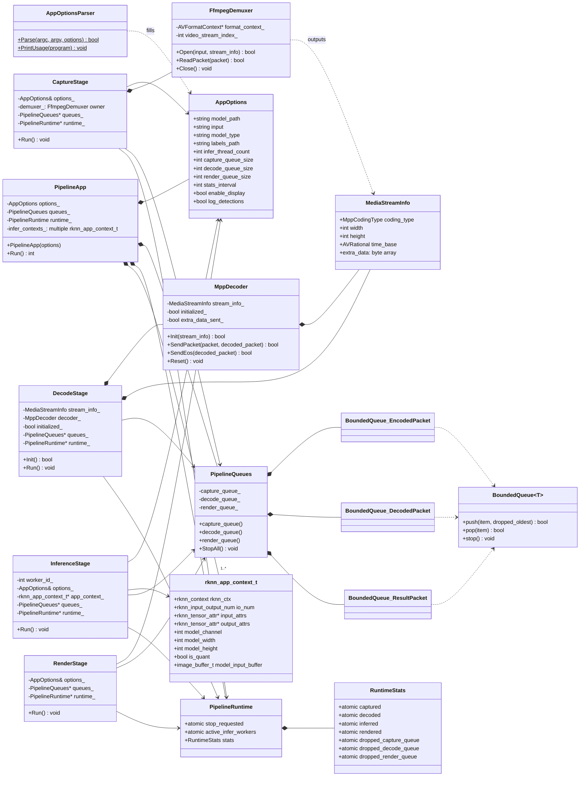
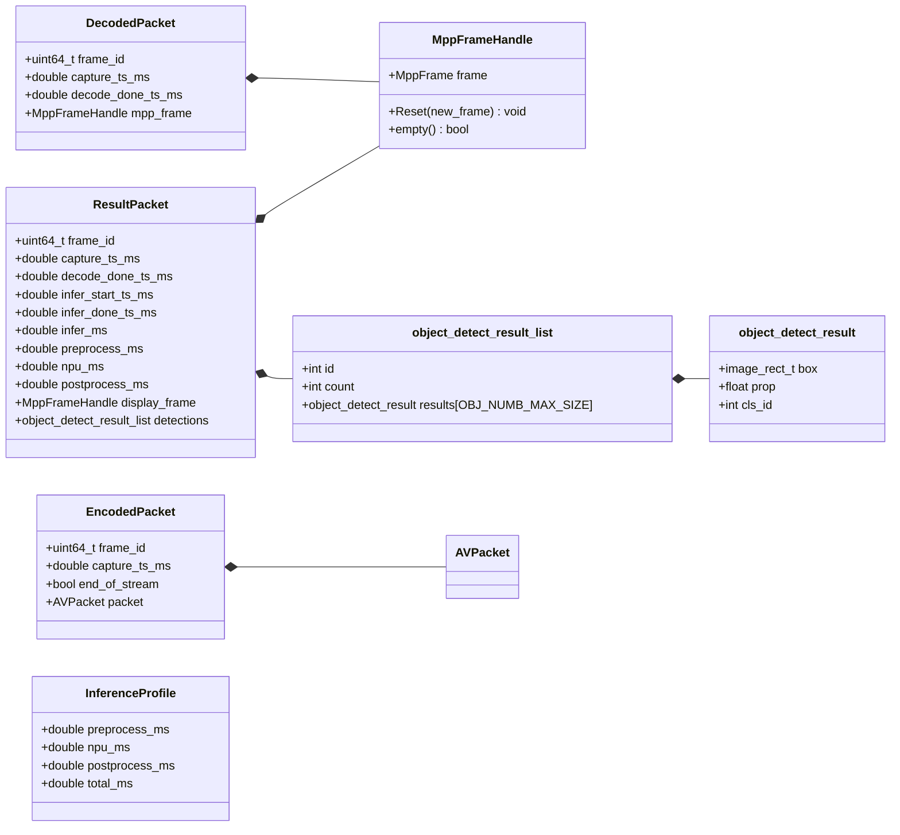

# IPCYolo-rk3588 类图

下面的类图聚焦当前项目的核心 C++ 类与关键结构体。

说明：
- 图中同时包含 `class` 和关键 `struct`，因为这个项目大量通过结构体在模块间传递数据。
- `main()`、`init_yolov5_model()`、`post_process()` 这类自由函数没有画成类。
- Mermaid 可在大多数 Markdown 预览器中直接渲染。

## 核心编排类图

## 数据结构关系图

## 额外说明

- `PipelineApp` 是总编排器，负责创建并启动 `CaptureStage -> DecodeStage -> InferenceStage -> RenderStage`。
- `PipelineQueues` 是跨阶段共享的数据通道，底层基于 `BoundedQueue<T>`。
- `rknn_app_context_t` 不是类，但它是推理阶段最核心的模型上下文，因此在类图中单独展示。
- YOLOv5 / YOLOv8 的模型加载、推理和后处理当前主要通过自由函数围绕 `rknn_app_context_t` 工作，而不是面向对象类封装。
