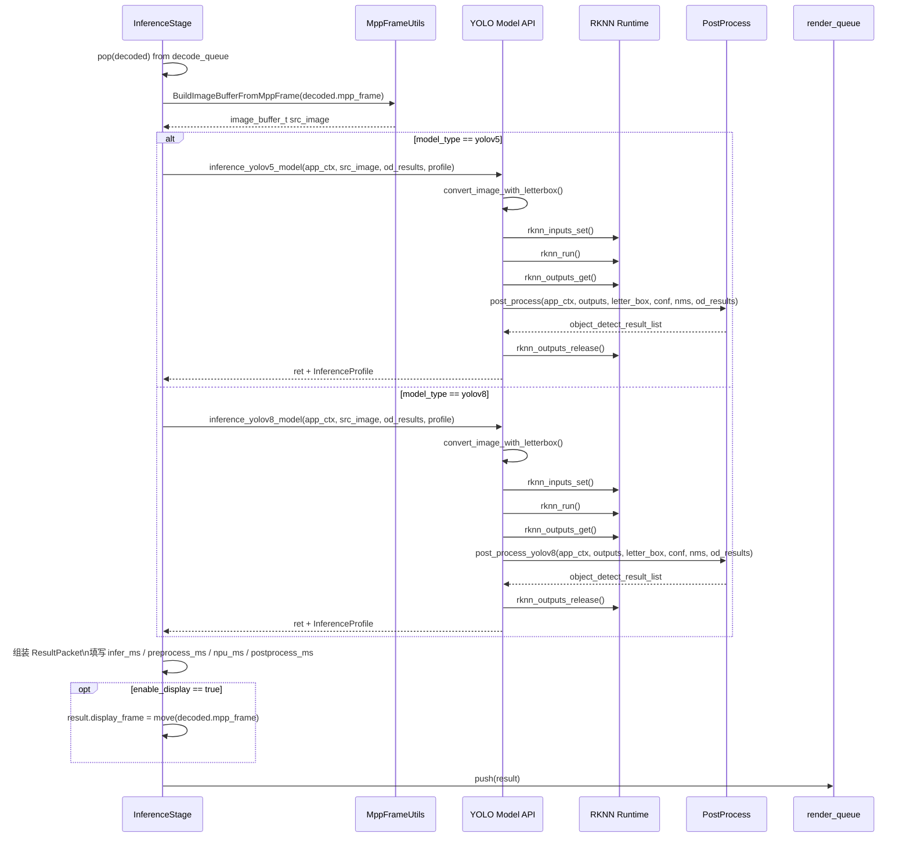

# IPCYolo-rk3588 线程图与时序图

下面补充两张更偏“运行过程”的图：

- 线程/数据流图：看清整条流水线如何串起来
- 单帧模型调用时序图：看清一帧数据从解码结果进入推理，到后处理输出结果的路径

## 线程/数据流图

```mermaid
flowchart LR

    subgraph Main["主线程"]
        A["main()"]
        B["AppOptionsParser::Parse()"]
        C["PipelineApp::Run()"]
        D["SignalWatcher::Start()"]
        E["探测输入流\nprobe_demuxer.Open()"]
        F["DecodeStage::Init()\nMPP decoder init"]
        G["正式创建 demuxer"]
        H["InitModelContexts()"]
        I["init_post_process()"]
        J["启动 4 类线程"]
        K["等待各线程 join"]
        L["ReleaseModelContexts()"]
        M["deinit_post_process()"]
    end

    subgraph T1["采集线程 CaptureStage::Run"]
        C1["FfmpegDemuxer::ReadPacket()"]
        C2["封装 EncodedPacket"]
        C3["push -> capture_queue"]
        C4["发送 EOS"]
    end

    subgraph T2["解码线程 DecodeStage::Run"]
        D1["pop <- capture_queue"]
        D2["MppDecoder::SendPacket()\n/ SendEos()"]
        D3["得到 DecodedPacket"]
        D4["push -> decode_queue"]
    end

    subgraph T3["推理线程组 InferenceStage::Run x N"]
        I1["pop <- decode_queue"]
        I2["BuildImageBufferFromMppFrame()"]
        I3["inference_yolov5_model()\n或 inference_yolov8_model()"]
        I4["封装 ResultPacket"]
        I5["push -> render_queue"]
    end

    subgraph T4["渲染线程 RenderStage::Run"]
        R1["pop <- render_queue"]
        R2["LogDetectionsIfNeeded()"]
        R3["可选显示\nDrmDisplay::Present()\n只申请 Overlay Plane\n不占用 Primary Plane"]
        R4["PrintRuntimeStats()"]
    end

    subgraph T5["信号线程 SignalWatcher::Run"]
        S1["等待 SIGINT / SIGTERM / SIGHUP"]
        S2["RequestPipelineStop()"]
    end

    A --> B --> C --> D --> E --> F --> G --> H --> I --> J
    D --> T5
    J --> T1
    J --> T2
    J --> T3
    J --> T4

    C1 --> C2 --> C3 --> D1
    D1 --> D2 --> D3 --> D4 --> I1
    I1 --> I2 --> I3 --> I4 --> I5 --> R1
    R1 --> R2 --> R3 --> R4
    S1 --> S2

    C4 --> D1
    S2 --> K
    T1 --> K
    T2 --> K
    T3 --> K
    T4 --> K
    K --> L --> M
```

## 单帧模型调用时序图

这张图描述的是“一帧已经进入 `decode_queue` 之后”，在单个 `InferenceStage` worker 中的调用路径。

## 补充说明

- `CaptureStage`、`DecodeStage`、`InferenceStage`、`RenderStage` 各自通常对应独立线程。
- `PipelineApp` 现在还会额外启动一个 `SignalWatcher` 线程，专门等待 `SIGINT / SIGTERM / SIGHUP`，收到后统一走 `RequestPipelineStop()`。
- 推理阶段不是单线程，而是 `N = infer_thread_count` 个 worker 并行消费 `decode_queue`。
- `DecodeStage` 当前只走 `MppDecoder` 硬解路径，没有软件解码回退。
- `InferenceStage` 自身不直接做 RKNN 细节，而是分发到 `inference_yolov5_model()` 或 `inference_yolov8_model()`。
- `RenderStage` 即使关闭显示，也仍然负责消费结果、打印统计和维持流水线收尾。
- 显示路径当前只申请 `Overlay Plane`，不会去占用系统 `Primary Plane`。
- 这条显示路径依赖桌面或其他显示服务已经把 `Primary Plane` 激活在同一个 `CRTC` 上；如果没有现成桌面主图层，初始化会失败并退成无显示。
- 用户按 `Ctrl+C` 时，不再是粗暴结束进程，而是尽量等待 demux/decode/infer/render 正常收尾，再释放 DRM 资源、恢复显示状态并交还 Master。
